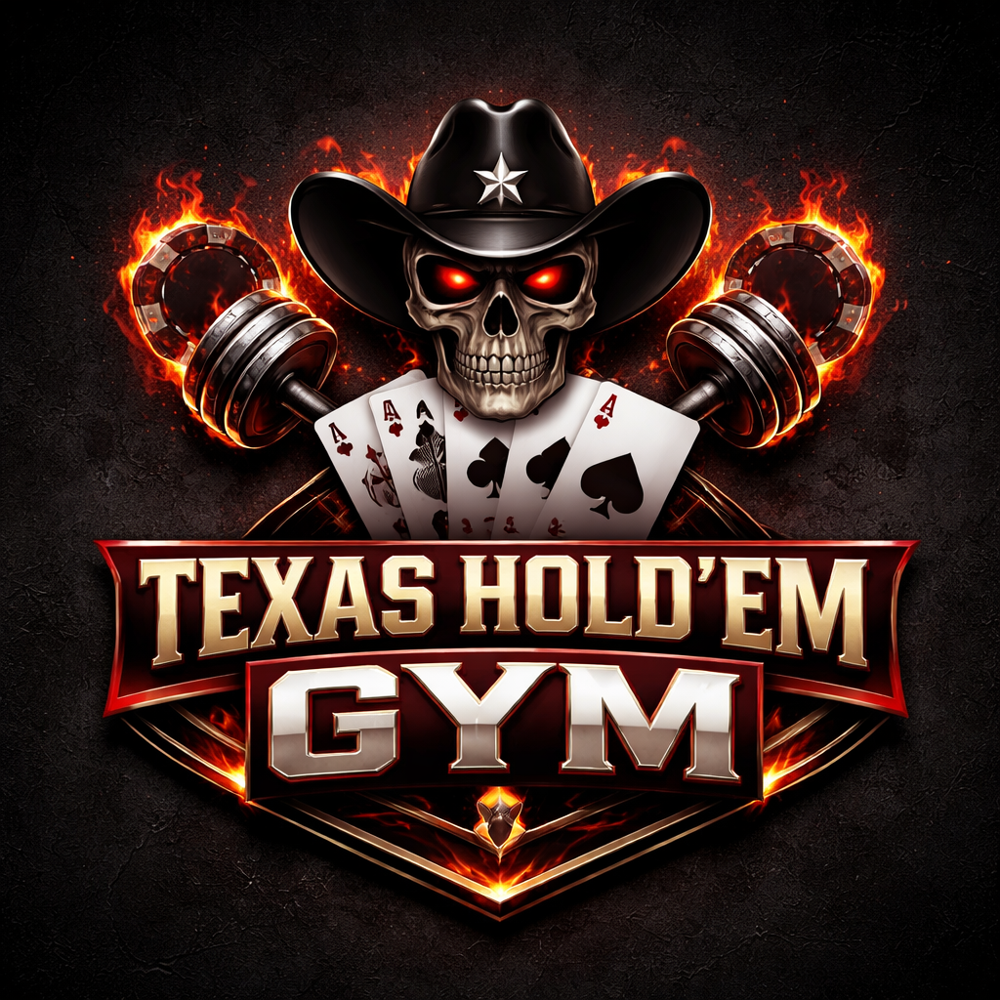

# Texas Hold’em Gym

<p align="center">
  
</p>

**Texas Hold’em Gym** is a desktop playground for no-limit Texas Hold’em: a live table with bots, range/strategy setup, preflop **solver + Monte Carlo equity** tools, **preflop and flop training drills**, and **bankroll / stats** tracking. The UI is **Qt 6 (QML / Qt Quick)**; game logic, evaluation, and tests are **C++17**.

## What’s in the box

- **Lobby & table** — configurable blinds and stacks; human vs bots; sit-out; timed decisions; pot + call indicator; Min / ⅓ / ½ / ⅔ / Pot / All bet-sizing presets.
- **Bots & ranges** — per-seat bot style and editable opening ranges (matrix / text); per-seat **buy-in** capped at **100× big blind**, with excess bankroll **off the table** (see [Game in code](docs/game-in-code.md)).
- **Solver & equity** — Monte Carlo equity vs a range or exact villain cards, with optional pot-odds and chip-EV (work is off the UI thread where applicable); toy Nash (Kuhn-style) solver for study.
- **Training** — **Preflop** through **river** drills with strategy-based grading, progress stats (accuracy, EV loss in bb), and configurable auto-advance delay.
- **Bankroll & stats** — seat stacks, off-table bankroll, leaderboard, and bankroll-over-time chart after each completed hand.
- **Core engine** — full hand from deal through showdown: blinds, streets, betting order, hand evaluation (best five of seven), side-pot–aware payouts. Details: **[Game in code](docs/game-in-code.md)**.

## Repository layout

| Path | Role |
|------|------|
| `CMakeLists.txt` | Top-level CMake: Qt 6, C++17, optional tests |
| `build.sh` | Optional script: clean configure, **Ninja** build, `ctest`, then runs the app |
| `poker/main.cpp` | `QGuiApplication`, QML engine; exposes **`pokerGame`** (`game`), **`pokerSolver`**, **`toyNashSolver`**, **`sessionStore`** (solver fields), **`trainingStore`**, **`trainer`** (`TrainingController`), **`appFontFamily`** |
| `poker/qml/` | QML UI; assets and `application.qrc` |
| `poker/poker/` | Cards, player, `game` + `game_ui_sync`, hand eval, bots, ranges, equity, solver, toy Nash, **training** store/controller, session store; **Boost.Test** smoke tests (optional) |

## Dependencies (summary)

You need a **toolchain**, **CMake**, **Qt 6.10+** (Quick stack), and **Boost** (headers + `unit_test_framework`) **only if you build tests** (`BUILD_TESTING` ON, default). See **[Building](docs/building.md)** for versions, optional tools, distro packages, environment variables, and troubleshooting.

| Requirement | Notes |
|-------------|--------|
| CMake | **3.26+** (`cmake_minimum_required` in tree) |
| C++ compiler | **C++17** (GCC, Clang, MSVC supported in principle) |
| Qt 6 | **≥ 6.10** — components: **Core**, **Gui**, **Qml**, **Quick**, **Network** (Quick pulls Gui stack on many platforms) |
| Boost | **≥ 1.70** — **unit_test_framework** only, for `Test_poker` when tests are enabled |
| Build backend | **Ninja** recommended (used by `build.sh`); Makefile generators work too |

## Build (quick)

Point CMake at your Qt install prefix (the directory that contains `lib/cmake/Qt6`):

```bash
cmake -S . -B build -DCMAKE_BUILD_TYPE=Debug -DCMAKE_PREFIX_PATH=/path/to/Qt/6.10.0/gcc_64
cmake --build build -j
ctest --test-dir build --output-on-failure
```

To configure **without** tests (no Boost required): `-DBUILD_TESTING=OFF`.

Convenience script (requires **`CMAKE_PREFIX_PATH`** or **`QT_LIBS`** pointing at your Qt 6 prefix):

```bash
CMAKE_PREFIX_PATH=/path/to/Qt/6.10.0/gcc_64 ./build.sh
```

**Run** (binary name and path):

```bash
./build/poker/Poker
```

The app starts on the **lobby**; navigate to the **table**, **bots & ranges**, **solver & equity**, **training**, or **bankroll & stats**. The live table page is `screens/GameScreen.qml` (`objectName: game_screen`), connected after load so the engine can sync state.

### Saved configuration

Table stakes, per-seat bot strategy and range text (exported form), per-seat **buy-in** and related bankroll fields, **sit out**, **solver & equity** field values, **trainer** auto-advance / decision time, and **training progress** are persisted. The primary store is a **SQLite** database at **`~/.local/share/TexasHoldemGym/Texas Hold'em Gym/texas-holdem-gym.sqlite`** (override the path with the **`TEXAS_HOLDEM_GYM_SQLITE`** environment variable). If SQLite cannot be opened, the app falls back to **`QSettings`** INI files under **`~/.config/TexasHoldemGym/`**. On first run, legacy **QSettings** data is migrated into SQLite automatically. Values load at startup and save on quit and when you apply stakes, change a bot strategy, apply range text, reset a seat to full range, toggle sit out, close the window (solver tab), or when training/session stores persist.

## Documentation

| Document | Contents |
|----------|----------|
| [docs/ci.md](docs/ci.md) | GitHub Actions: which jobs run on which branches (Linux vs Windows/macOS/snap) |
| [docs/github-actions-aws-amplify.md](docs/github-actions-aws-amplify.md) | **Setup:** GitHub Actions secrets and deploy to AWS Amplify (marketing site) |
| [docs/building.md](docs/building.md) | Dependencies, CMake configure, tests, card assets script, troubleshooting |
| [docs/architecture.md](docs/architecture.md) | App shell, QML ↔ C++, modules, persistence |
| [docs/game-in-code.md](docs/game-in-code.md) | NLHE as implemented: blinds, streets, side pots, stake cap, bankroll |
| [docs/next-steps.md](docs/next-steps.md) | Engineering backlog (performance, refactors, future features) |

## Tests

```bash
ctest --test-dir build --output-on-failure
```

Verbose output (each suite and case, timings):

```bash
ctest --test-dir build -R poker.unit -V
```

Or run the binary directly:

```bash
./build/poker/poker/tests/Test_poker --log_level=test_suite --report_level=detailed
```

When `BUILD_TESTING` is on, **Boost.Test** builds `Test_poker` from several translation units under `poker/poker/tests/`: `test_main.cpp` (module entry only), `test_smoke_cards_deck_player.cpp`, `test_smoke_game_engine.cpp`, `test_hand_evaluation.cpp`, `test_equity_engine.cpp`, `test_range_matrix.cpp`, `test_side_pots.cpp`, `test_bot_decisions.cpp`, `test_persistence_sqlite.cpp`.
